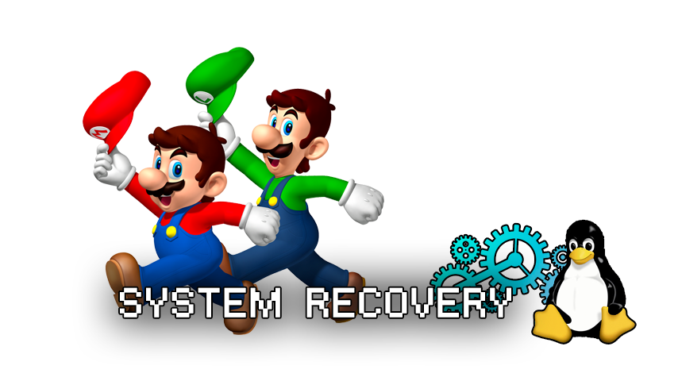
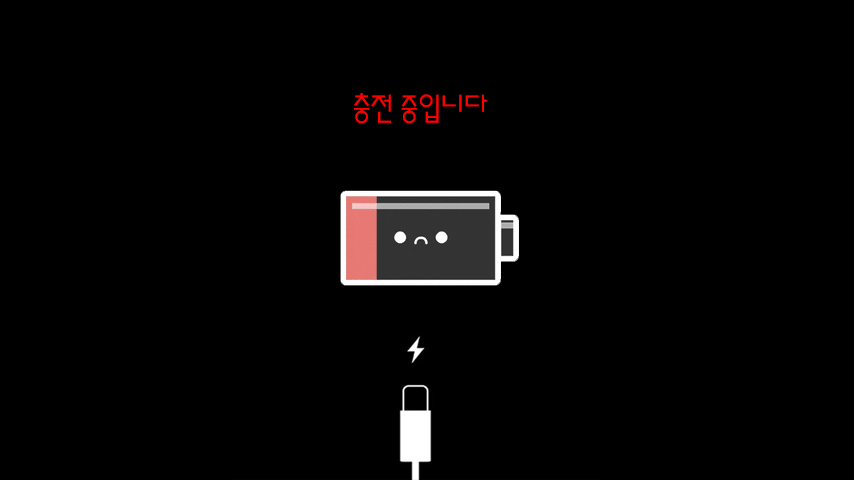
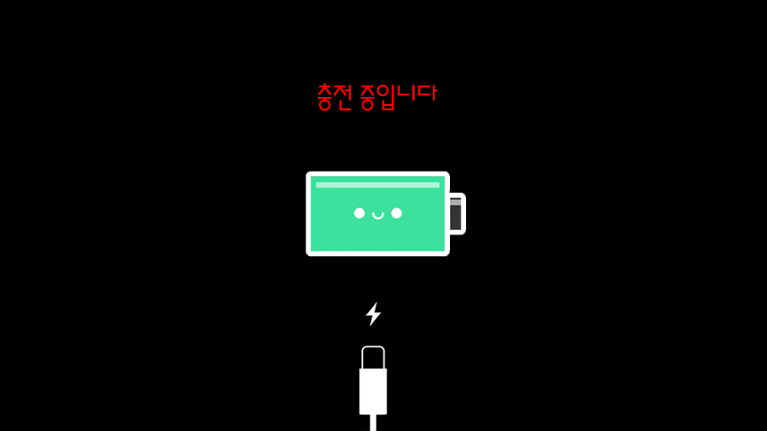
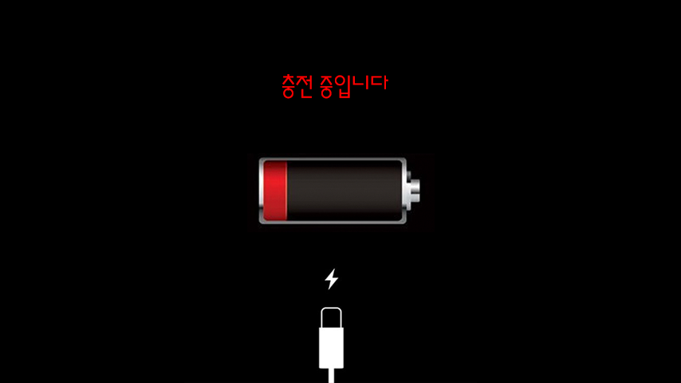
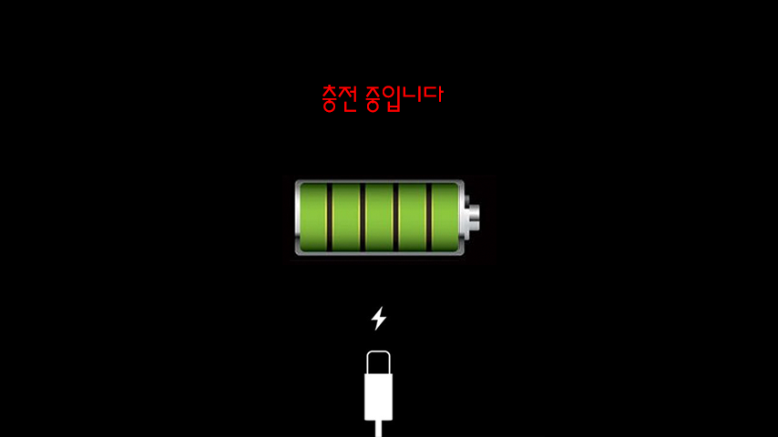
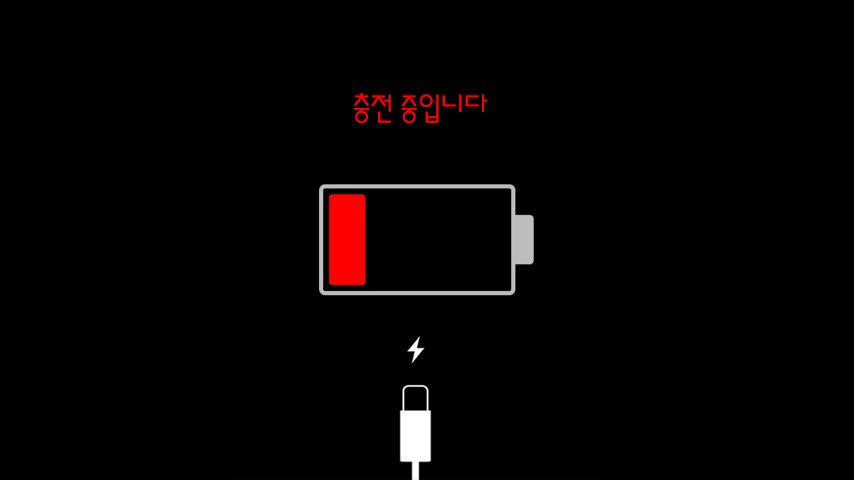
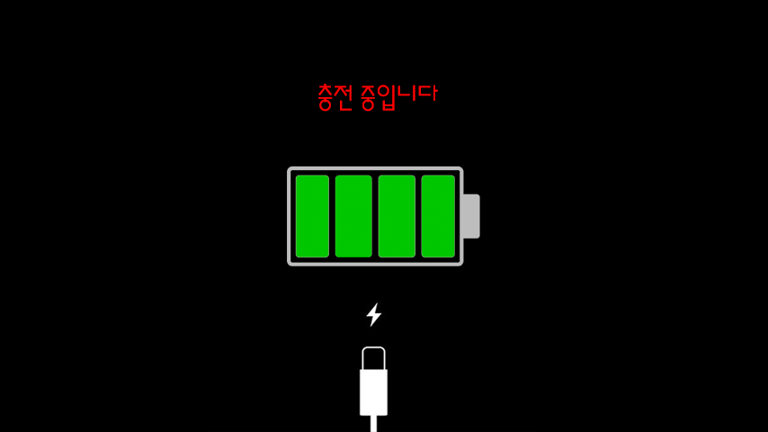

# OGS SDCard Recovery Image
## 밧데리 충전 이미지 및 시스템 관련 이미지 교체 방법

> 본 프로젝트는 하드커널의 Odroid GO Super의 SDCard Recovery Image를 만들때 밧데리충전 이미지나 로고등의 이미지를 교체하기 위한 프로젝트입니다.

> OGA도 적용이 가능하겠지만 OGA 장비가 없어 테스틑 하지 못했습니다. OGA 사용자는 이미지를 이용한 직접 빌드해서 사용하기를 바랍니다.

---

### 적용방법은 아래 사이트를 참조하십시오

### How to upgrade SPI Flash from SD Boot - 오드로이드 공식 위키
https://wiki.odroid.com/odroid_go_advance/recovery_spirom

### OGS 충전 및 경고 이미지 변경 방법 공유 - 구퓌님
https://cafe.naver.com/moopung/57250

---

## 미리보기

* 적용화면 


* 공통





* TYPE 1





* TYPE 2





* TYPE 3




## 적용방법 

release 디렉토리에서 마음에 드는 이미지 타입의 sdcard_recovery 파일을 선택해서 microSD 메모리에 플래싱합니다. 

플래싱툴은 balenaEtcher 를 추천합니다.

OGS 장비에 새로 만든 microSD카드를 넣고 부팅합니다.

자동으로 리커버리되고 재부팅됩니다.

재부팅되면서 정상 microSD로 부팅을 시도하는데 아직 리커버리 메모리가 꽂혀있기때문에 System Fail 이미지가 뜰것입니다. 그럼 microSD를 빼고 원래 사용하던 펌웨어 sd메모리 넣고 부팅하면 됩니다.

## 빌드방법

1. source 디렉토리에서 build_recovery.sh를 u-boot의 build_recovery.sh를 대체합니다

2. source 디렉토리에서 tools 디렉토리를 u-boot의 tools에 overwrite 하십시오

3. 아래 순서대로 빌드 한다.

```
make distclean
./make odroidgoa

make distclean
./make odroidgoa-spi

./build_recovery.sh { type1 | type2 | type3 }으로 원하는 이미지를 빌드한다
```

*[참고]* Bitmap은 RGB/24Bit/No Alpha Channel로 저장되어 있어야 하며 가끔 이미지가 깨진채로 나온다면 다시 한번 Bitmap옵션을 잘 맞춰서 저장하도록 한다.


